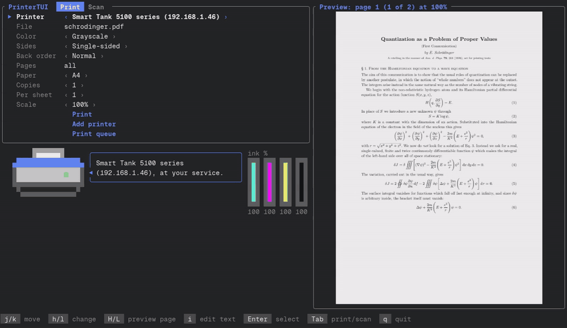

# PrinterTUI

Terminal app to print and scan on Linux, macOS and Windows.

[](docs/demo.mp4)

- Prints PDFs, photos (JPEG, PNG, BMP, GIF, TIFF, WebP; HEIC and AVIF on macOS, and on Windows with its free HEIF and AV1 extensions), text files, and other documents through LibreOffice.
- Preview of the pages as they will print; scale 25-200%, pages per sheet, copies, paper, color.
- Manual double-sided printing for printers without a duplexer.
- Scans from network printers (eSCL), SANE or Windows; saves PDF, searchable PDF (in any language) or PNG; copies (scan and print).
- Shows the printer's ink levels and problems (out of paper, jam, offline).
- 10 languages. Settings in `~/.config/printertui/config` (`%APPDATA%\printertui\config` on Windows).

## Install

Linux (Arch, Debian, Ubuntu, Fedora, openSUSE and their relatives) or macOS:

```sh
curl -fsSL https://raw.githubusercontent.com/s0artak/PrinterTUI/main/install.sh | sh
```

Windows 10/11, in PowerShell:

```powershell
irm https://raw.githubusercontent.com/s0artak/PrinterTUI/main/install.ps1 | iex
```

Or with [Scoop](https://scoop.sh): `scoop install https://github.com/s0artak/PrinterTUI/releases/latest/download/printertui.json`.

Run the same command again to update or uninstall (`... | sh -s uninstall` uninstalls directly).

macOS and Windows need nothing else. On Linux the installer adds CUPS (and on Arch Avahi, to find printers on the network) and puts `printertui` in /usr/local/bin, or in ~/.local/bin without root (`PRINTERTUI_BIN_DIR=<folder>` picks another). It asks for sudo only when something is missing, and on image-based systems (Fedora Silverblue, NixOS, SteamOS) it installs no packages but says what to add. Optional: LibreOffice (other documents; also from Flathub or the Snap Store), SANE (USB scanners), Tesseract (searchable PDFs on Linux).

Development on Arch: `bash test/dev-setup-arch.sh`. Before a commit, as CI checks: `cargo fmt`, `cargo clippy --all-targets -- -D warnings`, `cargo test`. `sh test/installer-preview.sh [fresh|jam|smudge]` (and `pwsh test/installer-preview.ps1` for Windows' installer) runs the installer without changing anything.

## Keys

```sh
printertui [file]
```

| Key | Action |
| --- | --- |
| Tab | Print, Scan, Settings |
| `j` / `k`, `gg` / `G` | Move |
| `h` / `l` | Change option |
| `H` / `L` | Previous / next page in the preview |
| `i` | Type in File, Pages, Save as or Scan folder (Esc to finish; Ctrl+U clears, Ctrl+W deletes a word) |
| Enter | Pick files or pages, print, scan, save, copy |
| Esc | Stop a scan |
| `q` | Quit |

On Linux and macOS, files dragged onto the terminal (or paths pasted into it) become the files to print, and on Linux Enter on File opens zenity or kdialog on a desktop, else yazi, lf, ranger, nnn or fzf in the terminal.

On the Scan tab's Page row:

| Key | Action |
| --- | --- |
| `r` / `R` | Rotate |
| `f` | Filter (gray, black & white) |
| `x` | Keep or leave out |
| `<` / `>` | Move the page |
| `dd` | Delete |

Double-sided: the front pages print, then flip the stack as shown and press Enter. If the back pages come out in reverse, set Back order to Reversed.

Prints already sent keep printing after you quit; quitting while one is still being sent waits for it (`q` twice quits right away). The Queue button cancels jobs.
